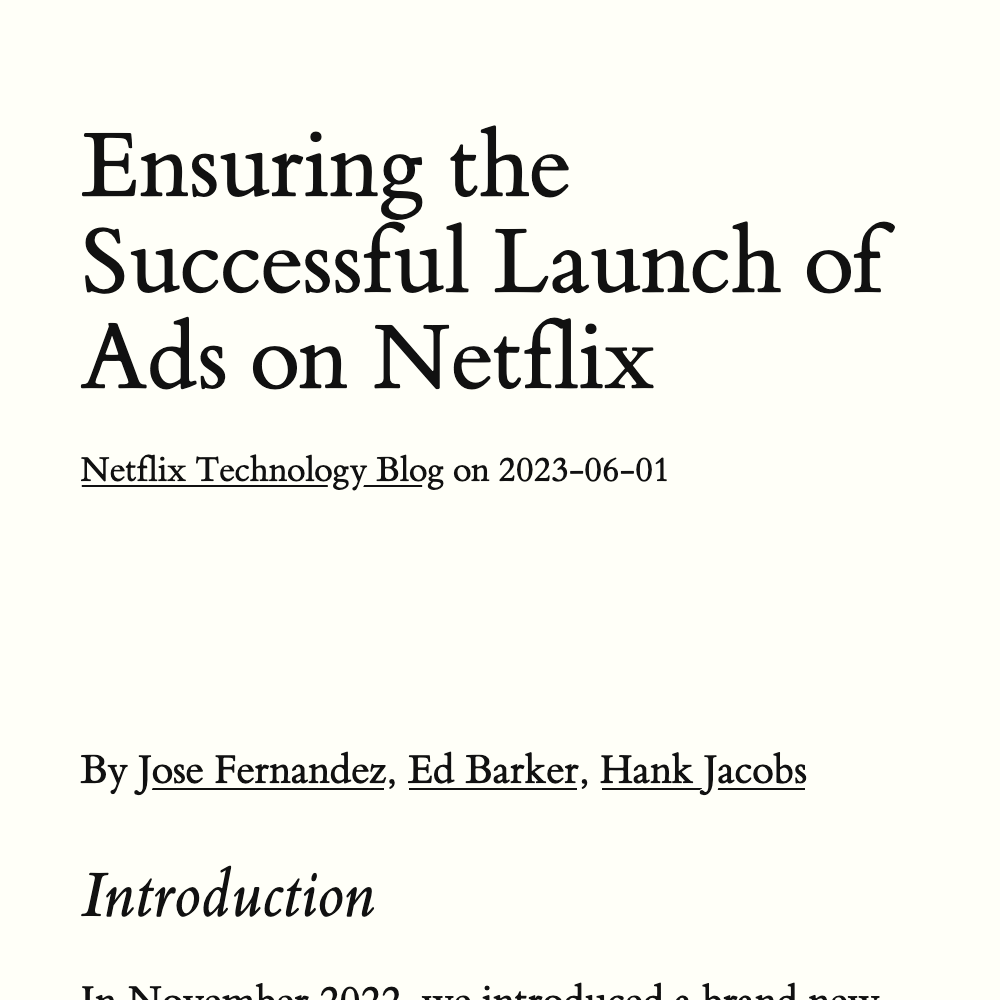

# UserScript: Redirect From Medium To Scribe

<table>
  <thead>
    <tr>
      <th>Before</th>
      <th>After</th>
    <tr>
  </thead>
  <tbody>
    <tr>
      <td>
        
      </td>
      <td>
        
      </td>
    </tr>
  </tbody>
</table>

## License

UserScript is distributed under the [MIT License](./License).
